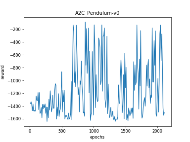
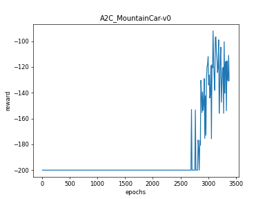

# A2C

## 相关论文

[Asynchronous Methods for Deep Reinforcement Learning](https://arxiv.org/pdf/1602.01783.pdf)

## 算法思路

同时训练一个负责选择行动的actor和一个负责评价的critic，actor的梯度为

$$ \nabla_\theta \mathcal{J}(\pi_\theta) = \underset{\tau\sim\pi_\theta}{\mathbb{E}}\left[ \sum^T_{t=0} \nabla_\theta \log \pi_\theta(a_t|s_t)A^{\pi_\theta}(s_t, a_t) \right]$$

其中advantage function为$$ A(s,a) = Q(s,a) - V(s) = r + \gamma V(s') - V(s) $$

critic的优化目标为

$$loss = L(r + \gamma V(s'), V(s))$$

## 实验结果

实现了连续动作空间和离散动作空间上的A2C算法，并在```Pendulum-v0```和```MountainCar-v0```上进行了测试，两种实现的主要区别是，连续动作空间的策略网络输出高斯分布的均值和方差，然后在分布中采样，离散动作空间则是输出每个动作的概率，根据概率选择动作。

代码写的确实太弱了，需要很多轮才能有效果，但也不清楚具体是哪里的问题。算法本身可能性能也比较弱，是on policy的，每次只利用当前一个样本更新网络，样本利用率差，数据相关性强(违背了独立同分布的假设)，更新的网络和目标网络相关性强。

### Pendulum-v0



在```Pendulum-v0```上有一定的效果，但训练轮数多(大概1000-2000轮才可以看到明显的改进)，结果总体不太好且不稳定。

### MountainCar-v0



在```MountainCar-v0```上由于奖赏稀疏，会出现策略网络的损失很小(1e-3甚至更小)，但车无法达到山顶的问题，此时观察输出的策略概率，不存在某个策略概率特别大的情况，即比较接近随机策略，说明策略网络没有学到任何东西。需要做reward shaping，2500轮后可以学到(感觉纯靠运气爬上去了一次才学会的)。
