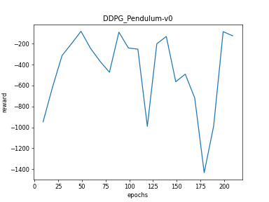
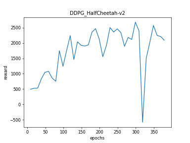
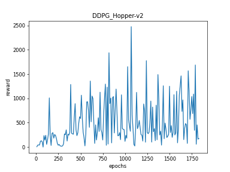

# DDPG

## 相关论文

[Deterministic Policy Gradient Algorithms](http://proceedings.mlr.press/v32/silver14.pdf)

[Continuous control with deep reinforcement learning](https://arxiv.org/pdf/1509.02971.pdf)

## 算法思路

DDPG将actor输出策略分布并采样得到随机策略的方法转化为直接输出确定性的策略。由于确定性策略降低了agent探索的能力，所以引入了off-policy的思想(通过加OU过程的噪声的策略探索，但学习的是确定性的策略)提高样本利用率，使用DQN中的target net并进行soft update和experience replay的方法提高训练的稳定性。

DDPG的critic是最小化TD误差。而actor更像是DQN在连续动作空间的扩展(毕竟都是DM提出的算法)，DQN中计算$argmax_aQ(s, a)$时需要遍历所有的a，所以无法应用到连续动作空间，但可以用一个神经网络近似$argmax_a$这个函数，神经网络的输出是使得$Q$值最大的action，所以DDPG中actor的更新梯度为$\nabla_{\theta^{\mu}}J = E_{s_t\sim \rho^{\beta}}[\nabla _{\theta}^{\mu} Q(s, a| \theta^Q) | _{s=s_t, a=\mu(s_t|\theta^{\mu})}]= E_{s_t\sim \rho^{\beta}}[\nabla _{\theta}^{\mu} Q(s, a| \theta^Q) | _{s=s_t, a=\mu(s_t)}\nabla _{\theta^{\mu}}\mu(s, \theta^{\mu}) | _{s=s_t}]$，即最大化$Q$。

## 实验结果

感觉DDPG效果很好，而且实现十分简单，同样的参数在多个任务上都有不错的效果。

### Pendulum-v0



```Pendulum-v0```：效果很好，学得很快(几十轮就可以看到很明显的效果，比A2C强多了...)，但不太稳定。

### HalfCheetah-v2



```HalfCheetah-v2```：效果同样很好，几十轮就可以看到明显效果(每轮1000个样本，所以大概几万个样本可以看到效果)，结果也比较稳定，跑动姿势也比较正常。

### Hopper-v2



```Hopper-v2```：效果也不错，姿势也比较正常，但不太稳定。
