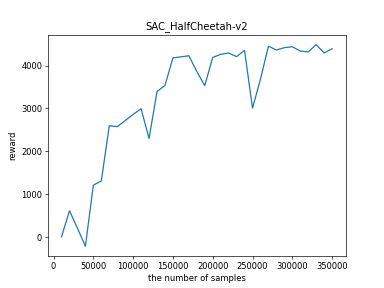
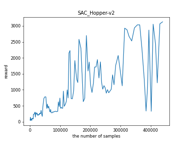

# SAC

## 相关论文

[Soft Actor-Critic: Off-Policy Maximum Entropy Deep Reinforcement Learning with a Stochastic Actor](https://arxiv.org/abs/1801.01290)

[Soft Actor-Critic Algorithms and Applications](https://arxiv.org/abs/1812.05905)

两个版本的SAC有略微的不同，第一个版本使用了单独的$Q$、$V$和策略网络和固定的超参数$\alpha$，第二个版本使用了$Q$网络和策略网络，用$Q$网络估计$V$的值，使用了自适应的$\alpha$

[Source code](https://github.com/rail-berkeley/softlearning)

[一个我感觉很好的实现](https://github.com/pranz24/pytorch-soft-actor-critic/blob/master/sac.py)

## 算法思路

SAC的改进是在AC框架下针对采样效率(off-policy)和策略鲁棒性(最大化熵的RL框架)进行了改进。使用随机策略并最大化熵，使得所有好的行动都有较大的概率执行(像TD3这样的确定性策略，就容易只学到一种好的策略)，增加鲁棒性，且利于之后学习更加复杂的任务。

在原来的AC框架下，增加了最大化熵项，优化目标为$J(\pi) = \sum_{t=0}^T\mathbb{E}_{(s_t, a_t)\sim \rho_{\pi}}[r(s_t, a_t) + \alpha H(\pi(·|s_t))]$，优化目标乘以$\alpha^{-1}$后，熵一项的系数为1，而奖赏的系数为$\alpha^{-1}$，可以看做是对奖赏做scaling(scale后奖赏项过小，会导致熵项作用大，策略接近均匀随机策略，过大则会导致熵项作用小，策略接近确定性策略，所以$\alpha$是一个比较重要的超参数，在初始版本SAC中，需要手动选择，第二个版本中则是通过学习得到合适的$\alpha$)

## 实验结果

SAC训练起来感觉会略微慢于TD3，我认为是因为前期时$\alpha$不稳定，一定轮数后，$\alpha$达到比较稳定的值后，效果会变得很好(如果$\alpha$没有收敛，可以尝试减小学习率)。总体来说性能和TD3比较接近，deterministic policy和stochastic policy各有优势，两种算法可以根据具体情况选择。

还有个问题没有想明白：训练时，如何让agent的姿势比较正确，在训练早期，有时agent倒立行走也可以达到很高的奖赏。初步认为姿势的正确性和奖赏还有建模有关：可以设置达到某个姿势有更高的奖赏或达到某个错误姿势直接死亡来限制；模型本身也影响着姿势，在特定的模型中，一定有一种姿势可以达到最快的运动，但通常可能由于建模的不精细，导致agent找到了某个bug的姿态，反而获得了比正常姿势更好的运动效果。

### HalfCheetah-v2



### Hopper-v2



学习率还是要小，```3e-4```在Hopper上很不稳定，而且$\alpha$也在飞快上升到十几，累计奖赏在1000左右就不再增加，但换到```3e-5```效果就很好，所以是不是要考虑每次尝试算法时，将学习率调的更小。
